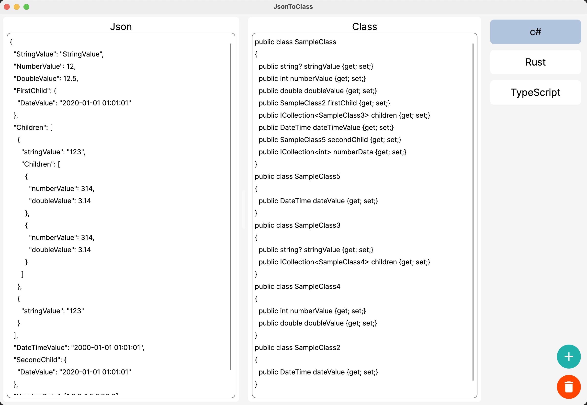

# JsonToClass

一个Json转Class的简单小工具。支持定义生成模版。



## 模版

基本格式 `@[define] "[text][$(parameter)]"`。例：

```txt
@name "c#" //名称
@string "string?" //string类型
@number "int" //整形
@boolean "bool" //bool类型
@dateTime "DateTime" //时间类型
@double "double" //浮点型
@array "ICollection<$(propertyArrayType)>" //数组
@null "object" //null类型
@propertyNamePolicy "CamelCase" //属性名称格式 'CamelCase' 'KebabCaseLower' 'KebabCaseUpper' 'SnakeCaseLower' 'SnakeCaseUpper'
@className "SampleClass" //类名称
@startObject "public class $(className)
{" // 遇到'{'时生成
@endObject "
}"
@property "
  public $(propertyType) $(propertyName) {get; set;}" //生成属性内容
```
